# Bitstream Compiler

An MLIR research compiler for analyzing multi-kernel GPU bitstream programs.
Starting from CUDA/C++ lowered by Polygeist, it reconstructs byte-indexed
memory accesses, discovers cross-kernel dependencies, proves when an
unbounded dependency reduces to a finite state, and emits a speculative-fusion
legality descriptor.

> **Status:** research prototype. The current endpoint is fusion legality and
> a fused-kernel descriptor. It does not yet generate executable fused CUDA,
> validation/recovery kernels, or hierarchical speculation.

## Research question

Bitstream pipelines commonly split parsing or regular-expression work across
multiple GPU kernels. Fusing those kernels is straightforward when every
consumer needs a finite, statically known window of producer bytes. Prefix
scans and data-dependent predecessor walks are harder: the set of possible
producer locations grows with the logical position, even when the information
crossing the boundary is only a few bits.

This compiler separates four questions:

1. **Where does every stage read and write in bytes?**
2. **Does a consumer require a finite producer byte window?**
3. **If no finite window exists, can the dependency be projected to a finite
   state?**
4. **Do those facts make the complete pipeline legal to fuse?**

The analysis compares the recovered SSA indices directly. It does not create a
second textual access-summary language or infer legality from source variable
names.

## Pipeline

```text
prepared CUDA/C++ workload
        │
        │ Polygeist / cgeist
        ▼
01  Generic MLIR
        │ bitstream-recover-access-graph
        ▼
02  Conservative bitstream access-set IR
        │ bitstream-dependence-analysis
        ▼
03  RAW dependencies and finite byte-window witnesses
        │ bitstream-dependency-classification
        ▼
04  Bounded and unbounded presentation groups
        │ bitstream-finite-state-inference
        ▼
05  Explicit finite-state proofs
        │ bitstream-speculative-fusion
        ▼
06  Fusion-legality and fused-kernel descriptors
```

The numbered files are deliberately committed under `analysis/`. A reader can
inspect the compiler transformation step by step without first building LLVM,
MLIR, or Polygeist.

## A complete cuJSON example

This walkthrough follows one dependency from the original escaped-quote C++
loop through every compiler artifact. The relevant edge is the bitmap
producer's write `a7` to the predecessor read `a11`. To keep the walkthrough
readable, snippets omit unrelated operands and give descriptive names to some
SSA values; the links below open the exact generated files.

```mermaid
flowchart LR
    accTitle: cuJSON dependency transformation
    accDescr: The escaped-quote predecessor dependency is followed from source C++ through generic MLIR, recovered access IR, dependency discovery, classification, finite-state proof, and fusion legality

    source_cpp(["C++ backward walk"]) --> generic_mlir["01 Generic MLIR"]
    generic_mlir --> access_ir["02 Access-set IR"]
    access_ir --> raw_dependency["03 RAW dependency"]
    raw_dependency --> classify_edge["04 Unbounded group"]
    classify_edge --> prove_state["05 Domain-2 proof"]
    prove_state --> fusion_legal(["06 Fusion legal"])
```



### Source C++

The prepared driver first produces the backslash bitmap, then invokes escaped
quote detection, the quote scan, and in-string detection:

```cpp
bitMapCreatorSimd(..., backslashes_GPU, quote_GPU, ...);
findEscapedQuoteMerge_NEW(backslashes_GPU, quote_GPU, real_quote_GPU, ...);
thrust_exclusive_scan_quote_count(quote_GPU, quote_GPU, total_padded_32);
inStringFinderBaseline(real_quote_GPU, quote_GPU, in_string_GPU, ...);
```

Inside `findEscapedQuoteMerge_NEW`, word `k` may inspect every predecessor
until it finds a word whose trailing-backslash parity is known:

```cpp
uint32_t overflow = 2u;
int j = k - 1;
while (overflow == 2u && j >= 0) {
    uint32_t backslash_j = backslashes_GPU[j];
    uint32_t trailing = static_cast<uint32_t>(__clz(~backslash_j));
    overflow = (trailing == 32u) ? 2u : (trailing & 1u);
    --j;
}
if (overflow == 2u) {
    overflow = 0u;
}
```

The complete source is in [`inputs/cujson/cujson.cpp`](inputs/cujson/cujson.cpp).

### 01: Polygeist generic MLIR

Polygeist lowers the source without introducing bitstream semantics. The
complete loop still carries its loaded value, `j`, and `overflow`; the exit condition remains
`overflow == 2 && j >= 0`. The following is abbreviated from
[`01_generic_mlir.mlir`](analysis/cujson/01_generic_mlir.mlir):

```mlir
%39:4 = scf.while (... %arg26 = %38, %arg27 = %c2_i32) {
  %is_unknown = arith.cmpi eq, %arg27, %c2_i32 : i32
  %continue = scf.if %is_unknown -> i1 {
    %in_range = arith.cmpi sge, %arg26, %c0_i32 : i32
    scf.yield %in_range : i1
  } else {
    scf.yield %false : i1
  }
  scf.condition(%continue) ... %arg26, %arg27
} do {
^bb0(..., %j: i32, %overflow: i32):
  %index = arith.index_cast %j : i32 to index
  %word = affine.load %backslashes[%index] : memref<?xi32>
  %not_word = arith.xori %word, %c-1_i32 : i32
  %trailing = math.ctlz %not_word : i32
  %parity = arith.andi %trailing, %c1_i32 : i32
  %next_j = arith.addi %j, %c-1_i32 : i32
  scf.yield ... %next_j, %parity
}
```

At this point the IR is still ordinary Polygeist `func`, `scf`, `arith`,
`affine`, and `memref` IR. It contains no bitstream dependency yet.

### 02: Recovered bitstream access-set IR

`RecoverSemantics.cpp` retains the possible predecessor addresses as an
`scf.while`, assigns the concrete read ID `a11`, and preserves the final
domain-2 projection derived from `~word → ctlz → & 1`:

```mlir
bitstream.kernel @bitMapCreatorSimd {
  %logical = bitstream.logical_index : index
  bitstream.write %backslashes[%logical] {
    access_id = "a7", byte_index = #map1, bytes = 1 : i64
  } : !bitstream.buffer
  ...
}

bitstream.kernel @findEscapedQuoteMerge_NEW {
%logical = bitstream.logical_index : index
%c-1 = arith.constant -1 : index
%first_predecessor = arith.addi %logical, %c-1 : index

scf.while (%j = %first_predecessor) : (index) -> index {
  %c0 = arith.constant 0 : index
  %in_range = arith.cmpi sge, %j, %c0 : index
  scf.condition(%in_range) %j : index
} do {
^bb0(%j: index):
  bitstream.read %backslashes[%j] {
    access_id = "a11", byte_index = #map, bytes = 4 : i64
  } : !bitstream.buffer
  bitstream.project_state %backslashes[%j] {
    domain = 2 : i64, modulus = 2 : i64,
    projection_kind = "ssa_not_ctlz_low_bit", read_access = "a11"
  } : !bitstream.buffer
  %next_j = arith.subi %j, %c1 : index
  scf.yield %next_j : index
}
}
```

This is conservative access-analysis IR, not executable replacement code. It
retains all possible predecessor locations while recording that the value
needed after validation belongs to `{0, 1}`. See
[`02_bitstream_raised.mlir`](analysis/cujson/02_bitstream_raised.mlir).

### 03: Raw dependency discovery

`DependenceAnalysis.cpp` matches the earlier bitmap write `a7` with read
`a11`. Because `a11` is controlled by the decreasing loop variable `j`, the
pass cannot construct one finite producer byte window:

```mlir
bitstream.dependency memory = raw
  producer_access = "a7" consumer_access = "a11"
  finite_state = none
  {buffer = @cujson_tokenizer_polygeist_raised::@arg3,
   producer = @cujson_tokenizer_polygeist_raised::@_Z17bitMapCreatorSimdPjPhS0_S0_S0_yi,
   consumer = @cujson_tokenizer_polygeist_raised::@_Z25findEscapedQuoteMerge_NEWPjS_S_iii}
```

Notice that discovery starts with `finite_state = none`; the existence of a
`project_state` is evidence, but the proof is performed later. See
[`03_raw_dependencies.mlir`](analysis/cujson/03_raw_dependencies.mlir).

### 04: Dependency classification

`DependencyClassification.cpp` places edges with a finite
`producer_byte_window` in the bounded group. Since `a7 → a11` has no such
window, it enters the unbounded group without adding another classification
attribute:

```mlir
bitstream.dependency_group kind = "unbounded" {
  bitstream.dependency memory = raw
    producer_access = "a7" consumer_access = "a11"
    finite_state = none {...}
}
```

See [`04_classified_dependencies.mlir`](analysis/cujson/04_classified_dependencies.mlir).

### 05: Finite-state inference

`FiniteStateInference.cpp` resolves `consumer_access = "a11"`, verifies that
exact read's buffer and SSA index against its `project_state`, and records the
two-state proof:

```mlir
bitstream.dependency memory = raw
  producer_access = "a7" consumer_access = "a11"
  finite_state = proven finite_state_domain = 2
  {states = [@cujson_tokenizer_polygeist_raised::
              @_Z25findEscapedQuoteMerge_NEWPjS_S_iii::@state0], ...}
```

The same pass independently proves the domain-2 quote-scan state used by the
in-string stage. See
[`05_finite_state_proof.mlir`](analysis/cujson/05_finite_state_proof.mlir).

### 06: Fusion legality

`SpeculativeFusion.cpp` now sees that every dependency either has a finite
producer byte window or an exact finite-state proof:

```mlir
bitstream.fusion_candidate {
  legal = true,
  reason = "every dependency without a finite byte window has an exact finite-state proof; remaining dependencies have finite byte windows",
  ...
}
bitstream.fused_kernel
  @cujson_tokenizer_polygeist_raised_speculative_fusion_kernel
  strategy = decoupled_lookback {...}
```

This descriptor is the current compiler endpoint; it does not yet contain the
generated fused CUDA body. See
[`06_fusion_legality.mlir`](analysis/cujson/06_fusion_legality.mlir).

## Repository structure

```text
bitstream-compiler/
├── inputs/                         # Prepared CUDA/C++ examples
│   ├── cujson/cujson.cpp           # cuJSON tokenizer and UTF validation
│   ├── gpjson/gpjson.cpp           # gpJSON kernel pipeline
│   └── bitgen/
│       ├── bitgen.cpp              # Parseable one-regex driver
│       └── regex_0.cu              # One BitGen-generated regex body
│
├── mlir/bitstream/
│   ├── include/Bitstream/
│   │   ├── BitstreamDialect.td     # Dialect declaration
│   │   ├── BitstreamTypes.td       # Types
│   │   ├── BitstreamOps.td         # IR operation definitions
│   │   └── BitstreamPasses.td      # Pass names and registration metadata
│   │
│   ├── lib/Dialect/Bitstream/
│   │   ├── IR/                     # Dialect, type, and verifier code
│   │   └── Transforms/             # Compiler-pass implementations
│   │
│   ├── tools/bitstream-opt/
│   │   └── bitstream-opt.cpp       # Command-line compiler entry point
│   └── test/                       # MLIR unit and integration tests
│
├── scripts/run-direct-index.sh     # Reproducible end-to-end driver
├── analysis/{cujson,gpjson,bitgen} # Numbered pass-by-pass IR snapshots
└── THIRD_PARTY_NOTICES.md          # Workload provenance and licenses
```

Generated build trees and Lit output are intentionally excluded from version
control.

## Pass-to-code map

| Step | Command-line flag | C++ implementation | Output |
|---|---|---|---|
| Frontend | `cgeist` | Polygeist, external dependency | `01_generic_mlir.mlir` |
| Recover semantics | `--bitstream-recover-access-graph` | `Transforms/RecoverSemantics.cpp` | `02_bitstream_raised.mlir` |
| Discover dependencies | `--bitstream-dependence-analysis` | `Transforms/DependenceAnalysis.cpp` | `03_raw_dependencies.mlir` |
| Group dependencies | `--bitstream-dependency-classification` | `Transforms/DependencyClassification.cpp` | `04_classified_dependencies.mlir` |
| Prove finite state | `--bitstream-finite-state-inference` | `Transforms/FiniteStateInference.cpp` | `05_finite_state_proof.mlir` |
| Check fusion legality | `--bitstream-speculative-fusion` | `Transforms/SpeculativeFusion.cpp` | `06_fusion_legality.mlir` |

All implementation paths in the table are relative to
`mlir/bitstream/lib/Dialect/Bitstream/`. `scripts/run-direct-index.sh` invokes
the passes one at a time and saves the IR after each step.

## Core IR contract

Each stage has a nameless `bitstream.logical_index`. Each real memory operation
contains its SSA index, byte width, byte-address map, and stable identity:

```mlir
%logical = bitstream.logical_index : index
%c1 = arith.constant 1 : index
%previous = arith.subi %logical, %c1 : index
bitstream.read %buffer[%previous] {
  access_id = "a1",
  byte_index = affine_map<(d0) -> (d0 * 4)>,
  bytes = 4 : i64
} : !bitstream.buffer
```

The physical interval is
`[byte_index(index), byte_index(index) + bytes)`. A dependency points directly
to the IDs of the real producer write and consumer read. There is no separate
`bitstream.access`, dimension, iteration-domain, extent, or footprint summary.

`producer_byte_window` is a two-result affine map describing the finite
half-open producer interval needed by a consumer. Its presence is the bounded
witness. Dependencies with a scan producer or loop-carried predecessor read
have no such map and appear in the unbounded group.

Every dependency also has an independent finite-state status:

- `finite_state = none`
- `finite_state = proven finite_state_domain = N`

`proven` requires a concrete `bitstream.project_state` linked to the same
consumer `access_id`, buffer, SSA address, and finite domain. A projection on
one read cannot legalize another read of the same buffer.

More detailed operation contracts are documented in
`mlir/bitstream/README.md`.

## Assumptions and safety boundary

- Kernel stages are modeled as parallel loops over an explicit logical
  coordinate recovered from source SSA provenance.
- Regular addresses must be expressible with the supported affine arithmetic.
  The compiler never treats a variable as logical merely because it is named
  `i`, `j`, `k`, or `index`.
- `02_bitstream_raised.mlir` is conservative access-analysis IR, not executable
  replacement code. Reconstructed loops over-approximate possible addresses.
- A finite byte-window witness establishes ordinary local fusion legality.
  An edge without a finite window requires an exact finite-state proof.
- The current compiler does not prove arbitrary transducer associativity. It
  preserves and verifies the concrete projected state used for validation.
- The endpoint is a legality descriptor, not final CUDA code generation.

## Workloads and current trace results

| Workload | Dependency edges | Edges without a finite byte window | Required dependency proofs | Final result |
|---|---:|---:|---:|---|
| cuJSON tokenizer | 14 | 2 | 2 | legal speculative-fusion descriptor |
| gpJSON | 13 | 0 | 0 | legal finite-window descriptor |
| BitGen regex example | 27 | 0 | 0 | legal regex-state descriptor |

These counts describe the committed prepared inputs and should be regenerated
when the compiler or inputs change.

Finite-state inference additionally recognizes a domain-2 projection on the
gpJSON edge `a18 → a19`. That edge already carries a
`producer_byte_window`, so the projection is recorded in `05` but is not
required to make fusion legal. The previous phrase “1 bounded descriptive
proof” referred to this optional evidence; the table now reports only proofs
required for edges that have no finite byte window.

## Build and run

### Prerequisites

- LLVM/MLIR compatible with the checked-out Polygeist build
- Polygeist with `cgeist`
- CMake and Ninja
- A C++17 compiler

Set `POLYGEIST_ROOT` to the Polygeist checkout used for the build:

```bash
git clone <this-repository-url> bitstream-compiler
cd bitstream-compiler

export POLYGEIST_ROOT=/path/to/Polygeist

cmake -S mlir/bitstream -B build-bitstream-mlir \
  -DMLIR_DIR="${POLYGEIST_ROOT}/build-release/lib/cmake/mlir"
ninja -C build-bitstream-mlir bitstream-opt
```

Run one prepared workload into a new output directory:

```bash
bash scripts/run-direct-index.sh cujson /tmp/bitstream-cujson-run
bash scripts/run-direct-index.sh gpjson /tmp/bitstream-gpjson-run
bash scripts/run-direct-index.sh bitgen /tmp/bitstream-bitgen-run
```

The output directory must not already exist so that a previous compiler trace
cannot be overwritten accidentally.

### Tests

```bash
ninja -C build-bitstream-mlir check-bitstream
bash mlir/bitstream/test/run_smoke_tests.sh
```

## Relationship to related systems

- **BitGen** compiles specialized bitstream/regex programs into GPU kernels.
- **MPK** constructs and schedules mega-kernels for tensor programs.
- **This project** starts from existing CUDA/C++ kernel pipelines and asks
  whether their recovered cross-kernel memory dependencies permit ordinary or
  finite-state speculative fusion.

The project is therefore currently a dependence-and-legality compiler, not a
replacement for the complete BitGen backend or MPK runtime.
